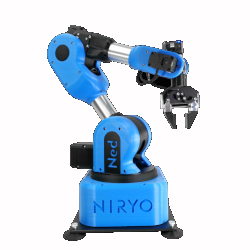

# **Web and Mobile Apps for Remote Control of a 6-DoF Robotic Arm**


**Authors:** 
<br>
20B2076 Nurfarahiyah Amirah binti Mohd Yaakub <br>
20B2125 Muhammad Luqman bin Mohd Jaffari <br>
20B6002 Firdaus bin Erzam 

## **Description**:
The School of Digital Science has acquired a Niryo NED 6 DOF robotic arm. The aim of this project is to develop a system that can control the robotic arm, there are three main parts to this project:
<br>
1. Web development
2. Mobile development
3. Server and robot control

<p style="text-align: center;"></p>


## **Setup Instructions**
Before doing anything, we need to clone this repository to our local machine. Just click the green button above and choose your preferred method of cloning.

There are five main sections to the setup:
- Web
- Mobile
- Digital Twin
- Robot
- Server

## Web
### Installing Unity
Firstly, we need to install Unity Hub. After installing Unity Hub we can install the version of Unity Editor we want which is 2021.3.10f1. For the installation of the Unity Editor make sure to have WebGL ticked, as we will be needing that to build our WebGL app.

### Opening the Project
To open the project that was cloned from the github on the Unity Hub app, click on the add project from disk button and find the folder under Website named My project. After adding the folder the project should now appear in the Unity Hub list, from this list we can click on the project to open it.

### Loading the Scene
Upon opening the project you will notice that the scene is currently empty. To load the created scene, we must open the scenes folder under assets, where we will find the SampleScene. Double click on the SampleScene to load in the created scene.

### Building the Project
To build the project we open the file category on the menu and click on Build Settings. Once we've opened build settings, we now need to change the target build platform to WebGL platform, this can be done by clicking on WebGL under the Platform list and then clicking on switch platform on the bottom right. This will take some time. Once the platform has been switched, we can now build the WebGL app, to do so we click on build and it will ask us to select a folder where the build will go. Building the project will take a few minutes.

### Running the Project
Now that we have built the website to run it we have to place all the files inside the folder our server is running on or start our server within the folder the build was created in. When running the website make sure that the Python Socket Server is running as the connecting to the socket will fail otherwise and you will need to reload the webpage and connect once the Python Socket Server is running, as the project will need to first connect to the Socket before any other command can be used. To connect the website to the Python Socket, first fill in the IP address and port where the Python Socket is hosted and then click on the Connect to Socket button. Now we can control the button by moving the 6 sliders to change the joint values and click on the "Move Joint" button to move the robot arm with the values in the sliders or we can control the gripper by clicking on the "Open/Close Gripper" button. In addition to this you can press the learning mode button to turn learning mode on or off, and finally there is a button to return the robot arm to the home position. After you are done using the robot arm do not forget to disconnect from the socket.

## Mobile

### Installing Unity:
1.	Install Unity Hub from a browser.
2.	After installing, launch Unity Hub and choose Unity version 2021.3.8f1 to be installed. If successfully found and installed, skip step 3.
3.  If the Unity version could not be found on the Unity Hub itself, install the 2021.3.8f1 version from this link:
    https://unity3d.com/get-unity/download/archive
4.	After being directed to “Add modules to your install”, tick Android Build Support.
5.	Complete installation of Unity 2021.3.8f1.

### Pulling Unity project from GitHub:
1.	In “zx-3201-202208-group-c-project” repository, click Mobile Application file.
2.	Pull “Ned Controller” project from the Mobile Application file in GitHub to your GitHub desktop.
3.	Copy project file from GitHub files to your own local disk.

### Opening project in Unity:
1.	Run Unity 2021.3.8f1.
2.	In “Projects”, click “Open” and choose “Add project from disk”.
3.	Choose the copied “Ned Controller” project from your local disk to open project in Unity.

### Changing Socket script IP address and port number:
1.	Open “Ned Controller” project in Unity.
2.	Under “Assets”, click the C# script “SocketButton”.
3.	Modify the content by changing the IP address to your python server IP address and chosen port number of your python server.

### Setting up Unity settings suitable for Mobile Application build:
1.	Open “Ned Controller” project in Unity.
2.	Go to File and click “Build Settings”.
3.	Under “Scenes In Build”, tick “Scenes/SampleScene” for the built scene to be viewed in the later built mobile application.
4.	Under “Platform”, click Android.
5.	Click “Build” to build the mobile application apk into your disk under preferred name.

### Running built Unity Android Mobile Application apk on Android Mobile Phone:
1.	Connect your Android Mobile Phone to your pc with the phone cable.
2.	Copy the built mobile application apk saved from your disk to your Android Mobile Phone under “Downloads” file.
3.	After transferring completed, click “Downloads” files on your phone and install the Unity Mobile apk.
4.	After installation completed, find the app on your phone and you can now control the Ned robot arm through your phone.

## Digital Twin
In case the digital twin from the web or mobile applications fail to load the correct properties, here are a list of things you need to change. If not, just skip towards the Server part.

### niryo_one Game Object
The `niryo_one` game object can be found in the hierarchy window. Here you need to head to its child `base_link` and check `Immovable` in one of its `Articulation Body` properties.

Since Niryo Ned's URDF is not readily available, we are using Niryo One instead as both are very similar. As a result, we need to change its minimum and maximum joint values to fit our Niryo Ned robot. You can do this by expanding the niryo_one game object and selecting each of its links. Change its joint limits by going to its `Articulation Body` and changing `Lower Limit` and `Upper Limit` below `X Drive`. Here are the six joints and their limits:
- shoulder_link : `-170` - `170`
- arm_link : `-120` - `35`
- elbow_link : `-77` - `90`
- forearm_link : `-120` - `120`
- wrist_link : `-100` - `55`
- hand_link : `-145` - `145`

### Robot Control Script
This script's properties can be accessed through the `niryo_one` game object. In case the `Joints` are not properly set, you need to drag each of the six robot links to its fields in order. The six links are already discussed above.

Next, its `Joint Speed`, there are a total of eight elements, however we will be only using six of them, corresponding to the six joints. From `Element 1` through `Element 6`, the values as of testing are: 52, 40, 50, 62.8, 62.8, 62.8.

## Robot
Before starting the server, we need to first set up the robot correctly. Make sure to:

1. Place the robot on a flat surface and make sure to have enough space for it to operate without hitting something or someone.
2. Connect the power plug.
3. Attach a gripper. For our testing, we were using the Adaptive Grippers.
4. Install the camera module and connect to the USB port on the robot.
5. Attach the platform so that the camera can calibrate.
6. Use an ethernet cable to connect the robot to the network.

Now you can turn on the robot and wait for the light indicator to change color from red. Once the light turns blue, the robot is ready for a connection. 

## Server
To start the server, you need to run two things:
1. server.py
2. A python web server

### Setting up your environment
Before running **server.py** we need to set up a virtual environment to store the packages needed in the server.py file. You can install **miniconda** from https://docs.conda.io/en/main/miniconda.html to set up the virtual environment.

Once installed, search for **Anaconda Prompt** and open it. A terminal will open. Now we will create an environment using the environment file (pyniryo.yml) included in this repository. To do it, type and run:
```
conda env create -f pyniryo.yml
```
This creates a new virtual environment named "pyniryo_env" and installs the packages specified in the environment file. To activate the new environment:
```
conda activate pyniryo_env
```
Now we can use this environment to run the file. 

### The packages
The most important package in this newly created environment is the PyNiryo library. This library is used to communicate and control the Ned robot. You can get the full documentation of PyNiryo from here https://docs.niryo.com/dev/pyniryo/v1.1.2/en/index.html.

There are other packages used for the server-client communication:

**socket**: This was originally used for client-server communication, but now only used to automatically get the machine's IP address.
<br>
**websockets**: Used for client-server communication.
<br>
**asyncio**: Used in conjunction with websockets.
<br>
**opencv-python (cv2)**: Used to encode robot stream image to jpg.

### Starting the server
Once set up, you are now ready to start the server. Just run the server.py file in the /Server directory. If you're using an IDE/text editor, make sure to select the correct interpreter (pyniryo_env). If you're using a terminal to run the file, just use the previous conda terminal and navigate to /Server and run this command:
```
python server.py
```

### Python Web Server
For web applications, you also need to set up the web server to host the website. The files needed for the website will be available after you finish building the project in the **Web** instructions section. You just need to place the files in a folder. To run the web server, open a terminal and navigate to created folder, then run:
```
python -m http.server
```
For example: Create a new folder named "Website" in the desktop. Place the files in the folder and open a terminal. Navigate to the /Website directory and run the command.

Congrats! If you follow all the instructions correctly, the server should now be running and ready to serve both web and mobile applications.
